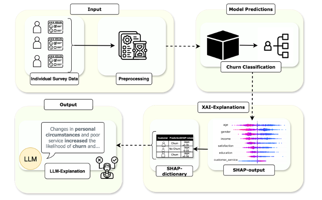
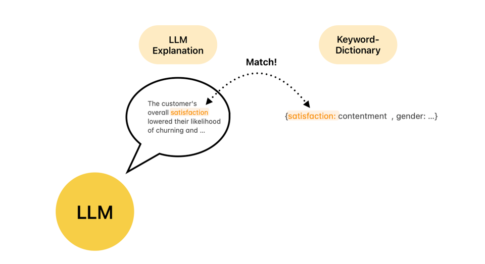
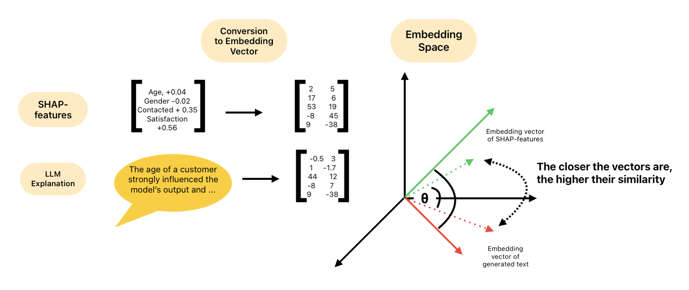
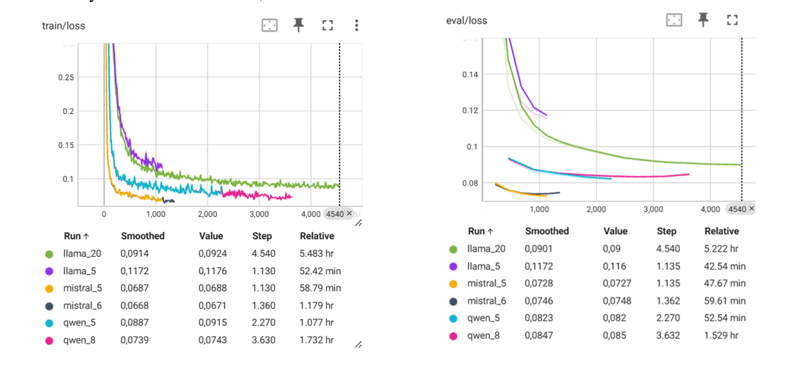
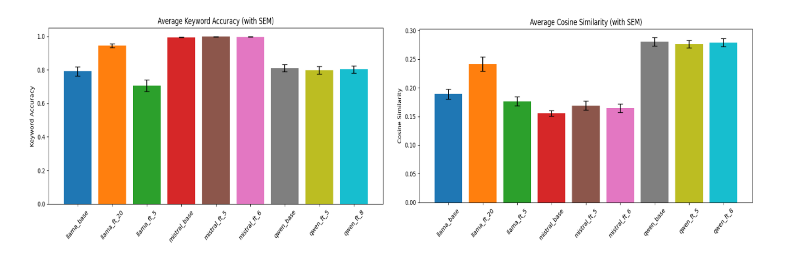

# Explaining the Explained: Leveraging LLMs to Interpret Switching Predictions in Health Insurance

Status: Research in Progress
Focus: Machine Learning (ML) · Explainable AI (XAI) · Large Language Models (LLMs) · Health Insurance

## Table of Contents

- [Project Motivation](#project-motivation)
- [Project Goals](#project-goals)
- [Key Research Questions](#key-research-questions)
- [Why This Matters](#why-this-matters)
- [SHAP-Based LLM Explanation Pipeline for Insurance Churn Prediction](#shap-based-llm-explanation-pipeline-for-insurance-churn-prediction)
  - [Model Architecture](#model-architecture)
  - [Pipeline](#pipeline)
  - [Data Preprocessing](#data-preprocessing)
  - [Evaluation Metrics](#evaluation-metrics)
- [Experiments](#experiments)
  - [Dataset](#dataset)
  - [Baseline Models](#baseline-models)
  - [Experimental Setup](#experimental-setup)
- [Results Summary](#results-summary)
  - [Training and Evaluation](#training-and-evaluation)
  - [Results](#results)
- [Limitations](#limitations)
- [Conclusion](#conclusion)
- [Quick Start](#quick-start)

  
## Project Motivation

- Health insurers face increasing churn in competitive markets.

- ML is used to predict customer switching, but explanations are often too technical for stakeholders.

- There’s a need for clear, human-understandable insights—especially in sensitive domains like healthcare.

- We explore how Large Language Models (LLMs) can bridge this gap by translating complex XAI outputs into accessible narratives.

## Project Goals

- Augment existing XAI tools (e.g., SHAP) with LLMs to improve interpretability of churn predictions.

- Identify the most influential features that drive customer switching.

- Automate evaluation of LLM-generated explanations—without relying on gold-standard references.

- Develop methods that support transparent and user-friendly AI in the health insurance domain.

## Key Research Questions

- **RQ1:** How do SHAP explanations compare to those generated by LLMs?

- **RQ2:** Does fine-tuning LLMs on structured features and SHAP outputs improve explanation quality vs. zero-shot prompts?

- **RQ3:** How can we automatically evaluate the quality of LLM explanations when no ground truth exists?

## Why This Matters

- Traditional ML models lack transparency—critical for trust in healthcare and insurance.

- Current XAI tools (e.g., SHAP, LIME) still require technical literacy.

- LLMs can generate natural language explanations, enhancing usability and stakeholder trust.

- Our proposed evaluation method enables scalable testing of LLM explanations using:

      Keyword and synonym matching

      Cosine similarity analysis

# SHAP-Based LLM Explanation Pipeline for Insurance Churn Prediction

## Model Architecture

- **Prediction Model**:  
  - LightGBM used for churn prediction.  
  - Employs leaf-wise tree growth for high accuracy (Wang et al., 2017).  
  - Loss function: multi-class cross-entropy.

- **Explanations with SHAP**:  
  - SHAP used to compute local feature importance.  
  - Features with SHAP value > 0.1 passed to the LLM.  
  - LLM generates human-readable explanations.

## Pipeline

---

## Data Preprocessing

- Dropped columns with >50% missing values.
- Filled missing values:  
  - `"keine Angabe"` for text, `99` for integers.  
- Spell-check performed on text columns.  
- Sentiment analysis (NLTK) on free-text ratings → categorical sentiment.
- Removed columns duplicating target variable to prevent data leakage.

---

## Evaluation Metrics

- **Keyword Matching**:  
  - Ensures all relevant features are mentioned.  
  - Synonyms from OpenThesaurus included.  
 

- **Cosine Similarity**:  
  - Measures semantic similarity between LLM-generated text and simple SHAP templates.  

---

# Experiments

## Dataset

- Insurance satisfaction survey (Boston Consulting Group).  
- 2018 participants, 360 features (demographics, satisfaction, etc.).

## Baseline Models

In our experiment we used three free baseline models:

| Model     | Params | Vocab | Layers | Heads |
|-----------|--------|--------|--------|--------|
| Mistral   | 7B     | 32k    | 32     | 32     |
| LLaMA 3.1 | 8B     | 32k    | 32     | 32     |
| Qwen 1.5  | 7B     | 151k   | 32     | 32     |

However, we also provide code for fine-tuning OpenAi models.

## Experimental Setup

- **Training Args**:
  - Epochs: 5 and 20 (with early stopping)
  - Learning Rate: `2e-5`
  - Batch Size: 4
  - Weight Decay: `0.01`

---

# Results Summary

- **Findings**:  
  - Mistral had highest keyword accuracy in all settings.  
  - Qwen consistently had highest cosine similarity.  
  - LLaMA improved most with extended training.
- **Training Duration Impact**:
  - 5 epochs: no significant improvement.
  - 20 epochs: LLaMA showed strong gains; others stagnated or regressed.

## Training and Evaluation

## Results

---

# Limitations

- No access to ground-truth explanation texts.
- Fine-tuning was on a proxy classification task.
- LLMs sometimes misinterpret directionality (positive/negative impact).
- Evaluation lacks fluency/logical consistency metrics.
- SHAP templates were overly simple → potential mismatch with natural explanations.

---

# Conclusion

- Pipeline combines SHAP with LLMs for explainable churn prediction.
- Keyword matching ensures feature completeness.
- Cosine similarity assesses semantic accuracy.
- Fine-tuning improved LLaMA but not Qwen or Mistral.
- Further work needed on natural explanation generation and evaluation.

# Quick start:

1. Clone the repository using:

            git clone https://github.com/HelHanna/Data-Science-Switching-Behaviour-in-Statutory-Health-Insurance.git

2. Create a conda environment and install the requirements:

            #!/bin/bash
 
            conda create --yes --name llm_tuning python=3.12.2
            conda activate llm_tuning
            
            pip install -r requirements.txt
   
**For Openai models**:

3. If you want to fine-tune a different Openai model, then please adjust line 10 and line 36 in the fine-tuning_gpt.py file:

            env_path = Path("Path to your Openai key")
            MODEL = "gpt-4o-mini-2024-07-18"

4. You also need to add your finetuned model in the alias-dictionary in the llm_explanations.py file:

            model_aliases = {
                "ft:gpt-4o-mini-2024-07-18...": "ft_gpt4o",
                "gpt-4o-mini-2024-07-18": "gpt4o_base",
            }
   please also insert your API key in line 18:

            api_key = "Your API key"

**For Huggingface models**:

5. If you want to fine-tune a llama-model, please go to the file fine_tuning_llama.py and fill in these lines (l.17):

            # set your parameters: which model to use, your access keys, directories etc.
            MODEL_NAME = "meta-llama/Llama-3.1-8B-Instruct"
            HF_TOKEN = "YOUR_HUGGINGFACE_TOKEN"
            DATA_PATH = "../preprocessing/participant_prompts.jsonl"
            OUTPUT_DIR = "OUTPUT_DIR"
            LOG_DIR = "LOG_DIR"
            MAX_LENGTH = 2048

6. You can now either load the model via peft or use the merge_model.py file to get your fine-tuned model locally. In the merge_model.py file, indicate the model that you want to use:

          base_model = AutoModelForCausalLM.from_pretrained(
          "meta-llama/Llama-3.1-8B-Instruct", #adjust if you are using a different model
          torch_dtype=torch.float16,
          device_map="auto",
          use_auth_token=True  # if required
      )
   
7. Then add the model aliases in the file llama_explanations.py:
   
            model_aliases = {
                "/Data-Science-Switching-Behaviour-in-Statutory-Health-Insurance/LLM_tuning/merged_llama3": "llama_finetuned",
                "meta-llama/Llama-3.1-8B-Instruct": "llama_base",
            }
   
8. To compare performances, please go to the file compare_models.py and adjust line 7ff. depending on which models you used:

            df_base = pd.read_csv("shap_llm_explanations_enhanced_gpt4o_base.csv")
            df_ft = pd.read_csv("shap_llm_explanations_enhanced_ft_gpt4o.csv")
            
            # Label the source/model
            df_base["model"] = "gpt4o_base"
            df_ft["model"] = "ft_gpt4o"
               
9. If you are using a different dataset, add your dataset to the data folder and adjust the following:

   train_model.py (l.44):
   
            pp = Preprocessing("../data/230807_Survey.xlsx", "Q18", "Result")
   
   fine_tuning_format.py (l.4/5):
   
            questions_df = pd.read_excel("../data/230807_Survey.xlsx", sheet_name=0)
            answers_df = pd.read_excel("../data/230807_Survey.xlsx", sheet_name=1)

10. After you made these adjustments, you can run the pipeline.sh file. Just set your Huggingface token (only required for llama not openai) and indicate which model to use:

            #!/bin/bash
            # set your Huggingface token here:
            # export HF_TOKEN=
            echo "Train prediction model and start SHAP generation..."
            python train_model.py
            
            echo "Starting LLM explanation generation..."
            python llm_explainations.py meta-llama/Llama-3.1-8B-Instruct
            
            echo "Starting evaluation..."
            python evaluation.py meta-llama/Llama-3.1-8B-Instruct
            
            echo "evaluation matrix saved."
            echo "compare models"
            python compare_models.py

           
Remark: We trained the model on both Google Colab and the LST Cluster. Fine-tuning OpenAI models can be done locally (you just need an API key; note that this costs money). However, for fine-tuning LLMs from Huggingface, you will need GPU access, and Google Colab will throw an OOM error for large models. We fine-tuned the models on the LST Cluster.
